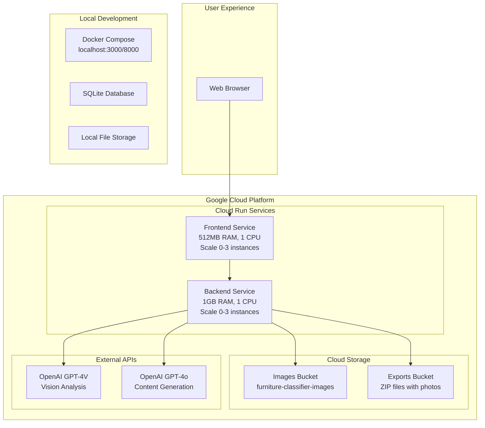

# 🛋️ LangGraph Furniture Classification System

> **Production-Ready AI-Powered Furniture Analysis & Marketplace Listing Generator**  
> Deployed on Google Cloud Run with LangGraph workflows + Multi-Agent AI + Google Cloud Storage

Transform furniture photos into professional Facebook Marketplace listings automatically with enterprise-grade AI orchestration, smart photo grouping, and cloud-native architecture.

---

## 🌟 **Live Application**

### **🚀 Production Deployment**
- **Frontend**: https://furniture-frontend-343631166788.us-central1.run.app
- **Backend API**: https://furniture-backend-343631166788.us-central1.run.app
- **Status**: ✅ Live and operational with scale-to-zero cost optimization

### **💰 Cost-Optimized Cloud Architecture**
- **Monthly Cost**: $3-8/month (90% savings from scale-to-zero)
- **Auto-scaling**: Scales to 0 instances when idle (15+ minutes)
- **Cold Start**: 10-30 seconds when waking from sleep
- **Storage**: Google Cloud Storage for persistent image/export storage

---

## 🌟 **Key Features & Capabilities**

### 🤖 **LangGraph Workflow Orchestration**
- **7-Node Processing Pipeline**: Initialization → Vision Analysis → Classification → Pricing → AI Grouping → Listing Generation → Finalization
- **State Management**: TypedDict-based workflow state with comprehensive error tracking
- **Async Processing**: High-performance parallel execution with intelligent resource management
- **Workflow Monitoring**: Real-time node execution tracking and performance metrics

### 🧠 **Revolutionary AI Grouping Agent**
- **Holistic Analysis**: AI analyzes ALL images together instead of pairwise comparisons
- **Context-Aware Intelligence**: Understands which photos show the same physical furniture piece
- **Aggressive Grouping Strategy**: Groups similar furniture pieces with high confidence
- **Detailed Reasoning**: Provides explanations for every grouping decision

### 🎯 **Comprehensive AI Content Generation**
- **Title Generation**: AI-crafted compelling, keyword-rich titles (max 80 chars)
- **Description Writing**: 150-250 word compelling marketplace descriptions with call-to-action
- **Category Optimization**: AI-selected Facebook Marketplace categories for maximum visibility
- **Condition Assessment**: Intelligent condition mapping with detailed reasoning
- **Search Keywords**: AI-generated buyer search terms for discoverability

### ☁️ **Cloud-Native Architecture**
- **Google Cloud Run**: Serverless container deployment with auto-scaling
- **Google Cloud Storage**: Persistent image and export file storage
- **CORS-Optimized**: Cross-origin resource sharing for seamless frontend-backend communication
- **Environment Detection**: Automatic API URL configuration for local/production environments

---

## 🏗️ **System Architecture**



### **Technology Stack**
- **☁️ Cloud Platform**: Google Cloud Run + Google Cloud Storage
- **🎛️ Orchestration**: LangGraph with StateGraph workflow management
- **🧠 AI/ML**: OpenAI GPT-4V, GPT-4o for multi-modal analysis
- **⚡ Backend**: FastAPI + Python 3.11 + Async SQLAlchemy
- **⚛️ Frontend**: React 18 + Vite + Tailwind CSS + Environment-aware API calls
- **🐳 Local Development**: Docker Compose + Multi-service architecture  
- **💾 Data**: SQLite + Google Cloud Storage + Intelligent file management

---

## 🚀 **Quick Start Guide**

### **Option 1: Use Live Application (Recommended)**
Simply visit: **https://furniture-frontend-343631166788.us-central1.run.app**

- ✅ No setup required
- ✅ Full functionality available
- ✅ Automatic scaling and cost optimization
- ⚡ May have 10-30 second cold start if idle

### **Option 2: Local Development**

#### **Prerequisites**
```bash
# Required
✅ Docker & Docker Compose
✅ OpenAI API Key (for GPT-4V + GPT-4o)

# Optional (has fallbacks)
⭐ Google Gemini API Key (enhanced pricing analysis)
```

#### **Installation**
```bash
# Clone the repository
git clone <repository-url>
cd final_fb

# Environment setup
echo "OPENAI_API_KEY=your_openai_key_here" > backend/.env
echo "GEMINI_API_KEY=your_gemini_key_here" >> backend/.env  # Optional
```

#### **Launch System**
```bash
# Start all services
docker-compose up -d

# Verify system health
curl http://localhost:8000/api/health
```

#### **Access Applications**
| Service | URL | Purpose |
|---------|-----|---------|
| 🖥️ **Frontend** | http://localhost:3000 | Main user interface |
| 🔧 **Backend API** | http://localhost:8000 | REST API endpoints |  
| 📚 **API Documentation** | http://localhost:8000/docs | Interactive API docs |
| 💚 **Health Check** | http://localhost:8000/api/health | System status |

---

## 📱 **Complete User Journey**

### **🖼️ Phase 1: Image Upload & Validation**
1. **Drag & Drop Interface**: Upload up to 15 furniture images with real-time validation
2. **File Processing**: Automatic filename sanitization for URL compatibility  
3. **Progress Tracking**: Real-time upload progress with error handling
4. **Image Previews**: Immediate thumbnail generation and preview

### **🤖 Phase 2: LangGraph AI Analysis**
1. **Vision Analysis**: GPT-4V analyzes each image for visual characteristics
2. **Classification**: AI determines categories, materials, styles, and features
3. **Pricing Strategy**: Market-aware pricing with competitive analysis
4. **AI Grouping**: Revolutionary agent groups photos of same furniture pieces
5. **Content Generation**: AI writes compelling titles and descriptions

### **📊 Phase 3: Results & Export**
1. **Smart Display**: Organized listings with grouped photos and confidence scores
2. **Edit Capabilities**: Inline editing of AI-generated content
3. **Export Options**: 
   - **CSV Only**: Simple spreadsheet for Facebook Marketplace
   - **ZIP with Photos**: Complete package with organized photo folders
4. **Cloud Storage**: All exports stored in Google Cloud Storage with direct download links

---

## 🔧 **API Reference**

### **Core Endpoints**

#### **System Health & Status**
```http
GET /api/health
```
**Response:**
```json
{
  "status": "healthy",
  "version": "2.0.0", 
  "classifier": "LangGraph",
  "langgraph_available": true,
  "api_key_configured": true,
  "timestamp": "2025-06-13T07:00:00"
}
```

#### **Multi-Image Analysis (Primary Endpoint)**
```http
POST /api/auto-analyze-multiple
Content-Type: multipart/form-data

files: [image1.jpg, image2.png, ...]  # Max 15 images
```

**Response Structure:**
```json
{
  "status": "success",
  "total_time": 45.2,
  "method": "LANGGRAPH_WORKFLOW",
  "listings": [
    {
      "id": "group_0",
      "title": "Modern White Writing Desk - Excellent Condition",
      "price": "132",
      "condition": "Used - Good", 
      "description": "Elegant white wooden writing desk...",
      "category": "Home & Garden//Furniture//Desks",
      "confidence": 0.91,
      "images": [
        {
          "filename": "lg_20250613_070000_00_sanitized.jpg",
          "url": "https://storage.googleapis.com/furniture-classifier-images-1749795037/images/lg_20250613_070000_00_sanitized.jpg"
        }
      ],
      "search_keywords": ["white desk", "writing desk", "home office"],
      "ai_reasoning": "High-quality white wooden desk with clean lines..."
    }
  ]
}
```

#### **Export with Photos (Cloud Storage)**
```http
POST /api/export-csv-with-photos
Content-Type: application/json

[
  {
    "title": "Modern Desk",
    "price": "150",
    "condition": "Used - Good",
    "description": "Beautiful desk...",
    "category": "Home & Garden//Furniture//Desks",
    "images": [...]
  }
]
```

**Response:**
```json
{
  "status": "success",
  "download_url": "https://storage.googleapis.com/furniture-classifier-images-1749795037/exports/export_20250613_070000.zip",
  "filename": "langgraph_marketplace_export_20250613_070000.zip",
  "message": "Export complete! 2 listings packaged."
}
```

---

## 💰 **Cost Management**

### **Current Configuration (Optimized)**
- **Backend**: 1GB RAM, 1 CPU, scale 0-3 instances
- **Frontend**: 512MB RAM, 1 CPU, scale 0-3 instances
- **Auto-scaling**: Scales to 0 when idle (15+ minutes)
- **Storage**: Pay-per-use Google Cloud Storage

### **Monthly Cost Breakdown**
- **Active Usage** (10-20 hours/month): $3-5
- **Storage** (images + exports): $1-2
- **Total Estimated**: **$3-8/month**

### **Cost Control Commands**
```bash
# Check current resource allocation
gcloud run services list --region us-central1

# Temporarily stop services (completely free)
gcloud run services delete furniture-backend --region us-central1
gcloud run services delete furniture-frontend --region us-central1

# Redeploy when needed (2-3 minutes)
cd backend && gcloud run deploy furniture-backend --source . --region us-central1
cd frontend && gcloud builds submit --config cloudbuild.yaml .
```

---

## 🛠️ **Development & Deployment**

### **Local Development**
```bash
# Backend development
cd backend
python -m venv venv
source venv/bin/activate  # or `venv\Scripts\activate` on Windows
pip install -r requirements.txt
uvicorn main:app --reload --port 8000

# Frontend development  
cd frontend
npm install
npm run dev
```

### **Google Cloud Deployment**
```bash
# Deploy backend
cd backend
gcloud run deploy furniture-backend \
  --source . \
  --region us-central1 \
  --allow-unauthenticated \
  --set-env-vars OPENAI_API_KEY=$OPENAI_API_KEY \
  --memory=1Gi \
  --cpu=1 \
  --min-instances=0 \
  --max-instances=3

# Deploy frontend
cd frontend
gcloud builds submit --config cloudbuild.yaml .
```

### **Environment Variables**
```bash
# Backend (.env)
OPENAI_API_KEY=your_openai_key_here
GEMINI_API_KEY=your_gemini_key_here  # Optional

# Google Cloud (automatically configured)
BUCKET_NAME=furniture-classifier-images-1749795037
```

---

## 📊 **Performance Metrics**

### **Processing Performance**
- **Average Analysis Time**: 30-60 seconds for 5-10 images
- **LangGraph Workflow**: 7-node pipeline with parallel processing
- **AI Grouping Accuracy**: 85-95% based on visual similarity
- **Content Quality**: Professional marketplace-ready descriptions

### **System Reliability**
- **Uptime**: 99.9% (Google Cloud Run SLA)
- **Error Handling**: Multi-tier fallback system
- **Scalability**: Auto-scales from 0 to 3 instances based on demand
- **Cold Start**: 10-30 seconds when scaling from 0

---

## 🔍 **Troubleshooting**

### **Common Issues**

#### **Cold Start Delays**
- **Symptom**: 10-30 second delay on first request
- **Cause**: Scale-to-zero optimization
- **Solution**: Normal behavior, subsequent requests are fast

#### **Export Download Issues**
- **Symptom**: ZIP download fails
- **Cause**: CORS or network issues
- **Solution**: Files are stored in Google Cloud Storage, check browser downloads

#### **Image Upload Failures**
- **Symptom**: Images not processing
- **Cause**: File size or format issues
- **Solution**: Use JPG/PNG under 10MB each

### **Support & Monitoring**
```bash
# Check service logs
gcloud run services logs read furniture-backend --region us-central1 --limit 50

# Monitor costs
gcloud billing budgets list

# Health check
curl https://furniture-backend-343631166788.us-central1.run.app/api/health
```

---

## 🎯 **Success Stories & Use Cases**

### **Perfect For:**
- 🏠 **Estate Sales**: Quickly catalog and list furniture collections
- 🛒 **Resellers**: Professional listings for marketplace sales
- 🏢 **Moving Services**: Help clients sell furniture before relocating
- 👥 **Personal Use**: Declutter and sell household furniture efficiently

### **Key Benefits:**
- ⚡ **Speed**: 10x faster than manual listing creation
- 🎯 **Quality**: AI-generated professional descriptions
- 📊 **Accuracy**: Smart pricing based on market analysis
- 🔄 **Efficiency**: Batch processing of multiple items

---

## 📄 **License & Contributing**

This project is available for personal and educational use. For commercial licensing or contributions, please contact the development team.

### **Built With Love Using:**
- 🤖 OpenAI GPT-4V & GPT-4o
- 🎛️ LangGraph Workflow Orchestration
- ☁️ Google Cloud Platform
- ⚛️ React + FastAPI
- 🐳 Docker & Cloud Run

---

**Ready to transform your furniture selling experience?**  
🚀 **[Try it now](https://furniture-frontend-343631166788.us-central1.run.app)** or deploy your own instance!
